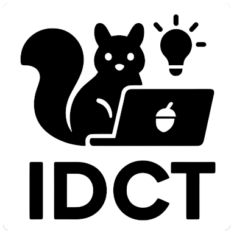

<table>
<tr>
<td width="180" align="center">
  
</td>
<td>

# Hi, I'm Bartosz Pachołek 👋

**Staff Backend Engineer @ R3Polska · Szczecin, Poland 🇵🇱**

Always eager to give 100% into development and design of software that solves unique problems. Web data‑mining, content delivery, modular architectures, iterative development. Fan of **Redis**, **Symfony**, **C#**, **NoSQL** and dedicated web solutions.

</td>
</tr>
</table>

---

## 👨‍💻 About me

I'm an **open‑source developer from Poland**, passionate about creating practical apps and libraries. Everything I share on GitHub is completely free to use — released under **MIT**, **BSD** or **Apache** licenses — so you're welcome to adapt, build upon, or enjoy it in any way that suits you.

<table>
<tr>
<td width="120" align="center">
  
</td>
<td>

🏷️ **IDCT** — my brand under which I release production‑grade open‑source libraries and tools. All of it lives at **[github.com/ideaconnect](https://github.com/ideaconnect)**.

🧪 **`bpacholek`** — my **private playground** account: experiments, prototypes and contributions to other people's projects (for example the [AI Trolley Dilemma Simulator](https://github.com/bpacholek/ai-trolley-dilemma-sim)).

</td>
</tr>
</table>

---

## 🧰 Tech I work with

**Languages:** PHP · C# / .NET · Go · JavaScript / TypeScript · C/C++ · Rust · Perl
**Frameworks:** Symfony · Zend · ASP.NET · .NET Core
**Messaging & streaming:** NATS / JetStream · RabbitMQ · Redis / KeyDB Pub/Sub · Mercure · Server‑Sent Events
**Storage:** PostgreSQL · MySQL / MariaDB · MongoDB · Oracle · Redis
**Infra & ops:** Docker · Caddy · FrankenPHP · nginx · CentOS / Debian · Linux admin
**Quality:** PHPUnit · Behat · explicit modular architecture · iterative development

> 🏆 Top skills: **Team Management**, **RESTful WebServices**, **Data Mining**

---

## 💼 Experience

### **R3Polska** — *Staff Backend Engineer*
📅 Feb 2026 – Present · 📍 Szczecin

Leading backend architecture behind the **Reverse Vending Machine (RVM)** platform — hardware, automation, sustainability. Hardware‑integrated APIs, real‑time async ecosystem.
*C# · PHP · Mercure · Redis · Docker · embedded‑adjacent backend*

### **Praetorian Technology** — *Head of Development*
📅 Dec 2020 – Jan 2026 (5 yrs 2 mos) · 📍 Remote (from Poland)

Architecture and development of a modern **FinTech platform** for high‑volume, high‑availability transactions. Led a small team while staying deeply hands‑on on performance‑critical features and event‑driven design.
*Symfony / PHP · C# · Redis / KeyDB · MongoDB · MySQL (MariaDB) · Behat · PHPUnit*

### **Digital Holding** — *Senior Backend Developer*
📅 Mar 2020 – Dec 2020 · 📍 Remote / Poland

APIs and webservices powering web & mobile apps. CRM integrations, high‑availability architecture, technical leadership for a junior/mid team.
*Symfony 4/5 · MySQL · .NET Core 3 · .NET Framework 4.5*

### **Casamundo GmbH** — *6 years*
📍 Remote (company from Hamburg)

- **Lead PHP Developer** · Aug 2018 – Dec 2019 — Led a team on a Symfony‑based data import/export framework; built a unique QA automation system using data‑comparison across app versions; payment & REST integrations.
- **Senior PHP Developer** · Jan 2014 – Aug 2018 — Designed a PHP data‑parsing framework on Symfony components for large‑scale content delivery; SOAP/XML/JSON integrations; custom ORM workflows, XML pipelines, Linux admin.

*PHP · Symfony · MySQL · SOAP / XML / JSON · data‑mining*

### **Poczta Polska S.A.** *(Polish Post)* — *IT Solutions Auditor*
📅 Oct 2013 – Jan 2014 · 📍 Warsaw

Comprehensive audit of web IT solutions for the national postal service. Findings accepted by senior leadership as a strategic roadmap.

### **YouWin** — *PHP Developer*
📅 Apr 2012 – Oct 2013 · 📍 Sliema, Malta

High‑performance, rapid‑deployment **NoSQL iGaming platform**. Payment gateways, gaming APIs, CDN‑based architectures.
*PHP · Zend Framework · MongoDB · Oracle · CentOS / Debian · nginx · SOAP / XML / JSON*

### **Squiz Poland Sp. z o.o.** — *2 years 1 month*
📍 Szczecin

- **Web Developer** · Oct 2010 – May 2012 — Enterprise web solutions, Squiz Matrix / Funnelback enterprise search, government & commercial clients in PL & UK.
- **Implementation Specialist** · May 2010 – Oct 2010 — Front‑end builds, Squiz Matrix customization, XML data feeds.

*PHP · C# · Perl · PostgreSQL · Oracle · JavaScript · Squiz Matrix · Funnelback*

### **Utel‑Net** — *Network Technician*
📅 May 2006 – Sep 2006 · 📍 Ujście, Poland

Government initiative — equipped 50 schools across the Kuyavian‑Pomeranian region with full computer labs. Cisco routers/firewalls, Windows SBS 2003.

---

## 🎓 Education

- **Zachodniopomorski Uniwersytet Technologiczny w Szczecinie** — B.Eng., IT / Computer Science *(2008–2012)*
- **Akademia Górniczo‑Hutnicza im. Stanisława Staszica w Krakowie**

🏆 *Honors:* Rookie of the year

---

## ⭐ Notable open‑source software

### 🥜 [NUTS](https://github.com/ideaconnect/nuts)
> Bridge **NATS subjects to browser‑friendly Server‑Sent Events** with a single Caddy directive.

A tiny Caddy module that turns any NATS subject into an SSE stream — no extra service, no glue code.

### 📨 [symfony‑nats‑messenger](https://github.com/ideaconnect/symfony-nats-messenger)
> Symfony Messenger transport for **NATS** with **JetStream** persistence support.

Drop‑in bridge that lets Symfony apps treat NATS / JetStream as a first‑class transport — perfect if you're moving off RabbitMQ or want async + replay in one place.

### 🧵 [php‑nats‑jetstream‑client](https://github.com/ideaconnect/php-nats-jetstream-client)
> Pure‑PHP client for **NATS JetStream** — the lower‑level building block that powers the Symfony bundle above.

### 📂 [idct‑sftp‑client](https://github.com/ideaconnect/idct-sftp-client)
> Friendly wrapper around SSH2 / SFTP for PHP — simplifies upload / download over **SSH / SCP / SFTP**. Battle‑tested over the years and still one of the most popular IDCT libraries.

➡️ Browse everything at **[github.com/ideaconnect](https://github.com/ideaconnect)**.

---

## ❤️ Sponsor my work

If any of my libraries or tools have saved you time, consider supporting their continued development — it genuinely helps me keep releasing software for free.

  
  &nbsp;
  

- ☕ **Buy Me a Coffee:** https://buymeacoffee.com/idct
- 💖 **GitHub Sponsors:** https://github.com/sponsors/ideaconnect

---

  Thanks for stopping by — feel free to open an issue or drop a star on anything you find useful. 🙌

